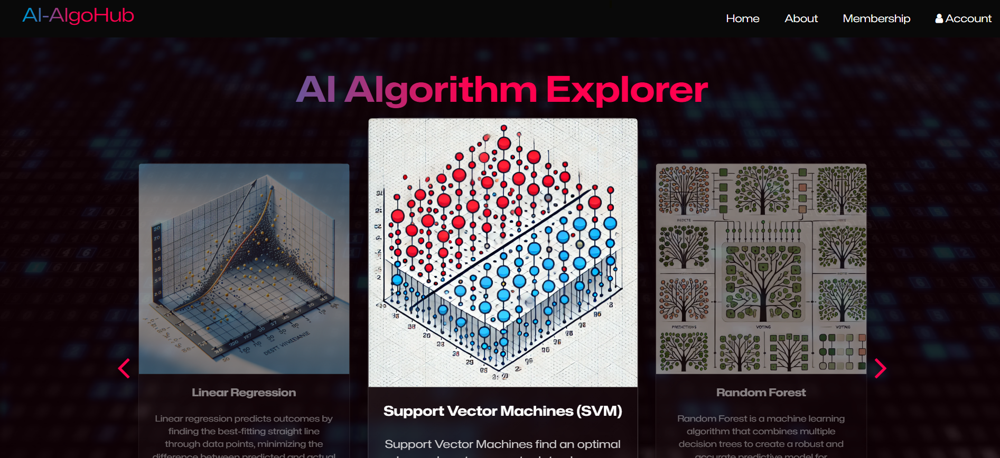
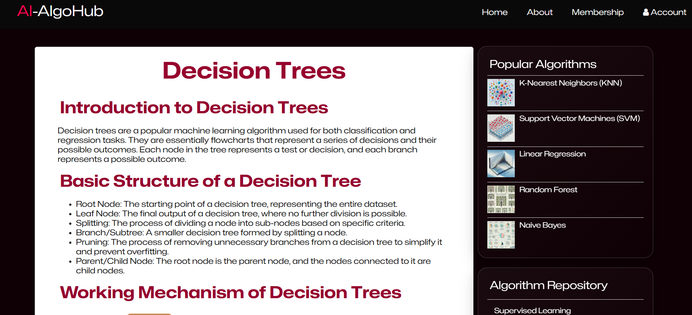
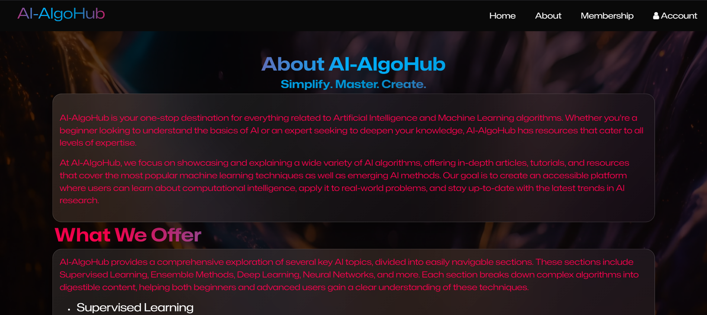

# AI-AlgoHub: Simplify. Master. Create.
AI-AlgoHub: A website showcasing AI and ML algorithms with detailed explanations and insights.

## Overview
**AI-AlgoHub** is a static web-based platform developed as part of my **B.Tech (CSE-AI) semester project**. It is designed to showcase and explain core AI and machine learning algorithms in a simple, intuitive, and educational format. This project reflects both theoretical understanding and practical application of trending computational intelligence methods.

### Features
-  **Interactive Algorithm Explorer**  
-  **Trending AI Techniques**  
-  **Categorized Learning Pages** (Supervised, Deep Learning, etc.)  
-  **Responsive Design**
-  **Student-Centric Content** — tailored for academic understanding

### Technologies Used
- HTML5  
- CSS3  
- JavaScript  
- jQuery 3.3.1  
- Bootstrap 5.0.2  
- Font Awesome 4.7.0  
- Owl Carousel 2.3.4

### Installation & Setup
1. Clone this repository:
    ```bash
    git clone https://github.com/abhayrohit/ai-algohub-where-ai-meets-simplicity.git
    cd ai-algohub-where-ai-meets-simplicity
    ```

2. Open `index.html` in any modern browser.

> No additional setup or backend is required since it’s a fully static frontend project.

### Screenshots

#### Homepage


#### Algorithm  Page


#### About  Page


#### Login Page 


#### Membership Page


### Contact

**Created by:** Abhay Rohit  
**Email:** abhay517035@gmail.com  
**GitHub:** [@abhayrohit](https://github.com/abhayrohit)

Thank you for checking out AI-AlgoHub! If you're a fellow student, feel free to explore, learn, and maybe even contribute by dropping a mail :))) . Let's simplify AI together. 😊

